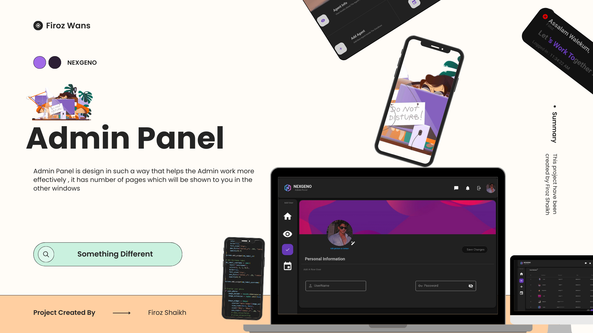
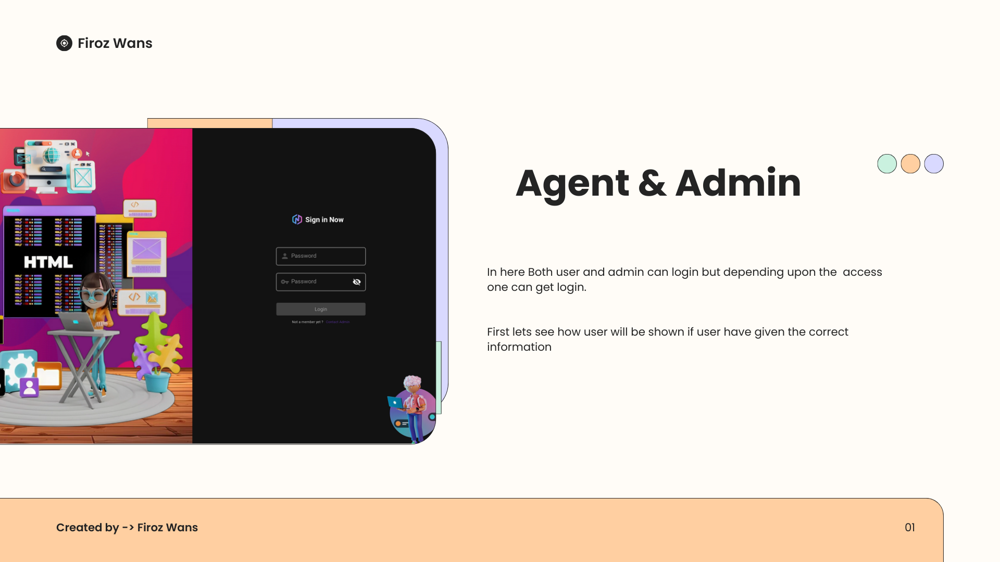
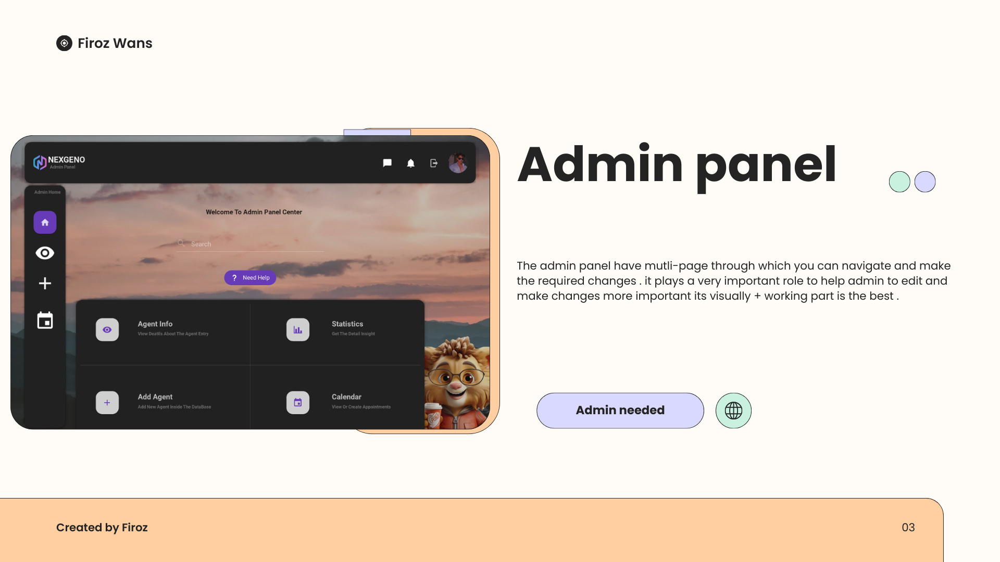
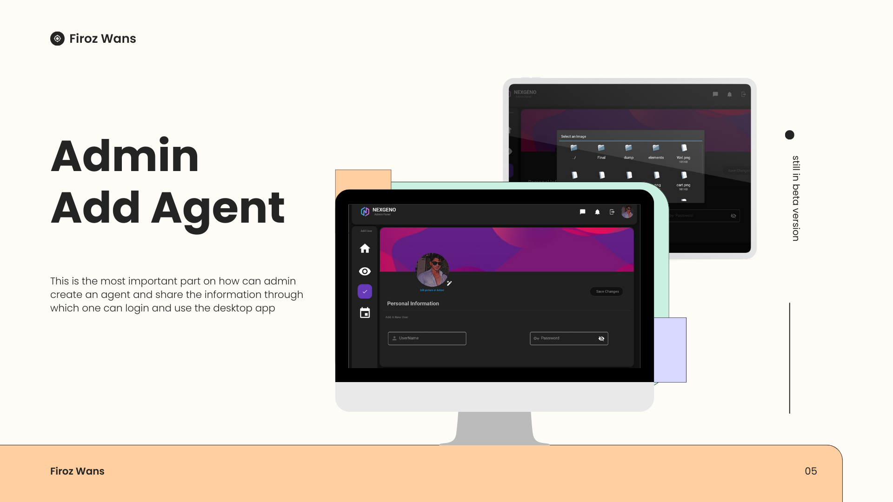
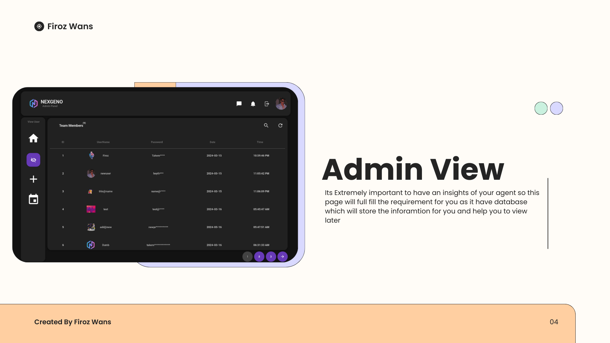
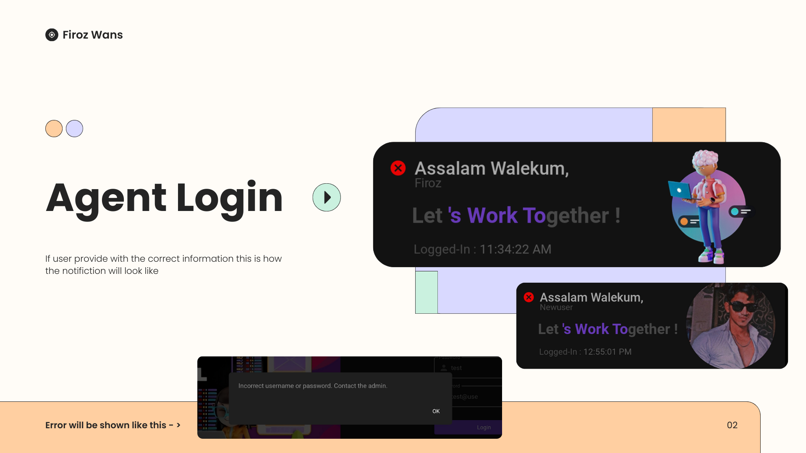

<h2 align="left" style="display: flex; align-items: center;">
  
  KivyMD Desktop Login & Admin Panel
</h2>


KivyMD **Desktop Login & Admin Panel** is a clean, easy-to-use desktop application built with Kivy and KivyMD.
It features a simple user login system and a powerful admin panel to manage **student or employee** access with ease.

<br>

<p align="left">
  <!-- Python -->
   &nbsp;
   &nbsp;
   &nbsp;
   &nbsp;
</p>


<p align="center">
  
</p>

<br>


> [!IMPORTANT]
>
> ### Why I Built This
> While working with a client, I faced a common problem — they wanted a simple desktop login system that could connect to their CRM. The idea was straightforward:
>
> - A user logs in from a desktop app  
> - The admin gets notified in the CRM  
> - Admins can control who logs in, edit credentials, or add/remove users  
> - Both users and admins access the **same app**, but are shown different interfaces based on their access level
>
> But most solutions were either too complex or web-only.
>
> So I built this prototype — a clean, functional **desktop app using Kivy and KivyMD**, featuring a login system and an admin panel that mimics how this workflow would operate in production.
>
> It’s simple, visual, and built to show exactly how such a system can integrate with CRM logic — while keeping the experience smooth for both users and admins from a single access point.

<br>


# How It Works: Step-by-Step User Guide

## 1. Login Screen  
<p align="left">
  
</p>
<p align="left"><em>Enter your username and password to access your dashboard.</em></p>

## 2. Admin Panel Overview  
<p align="left">
  
</p>
<p align="left"><em>Here you can create, edit, or disable user accounts..</em></p>


## 3. Adding a New User  
<p align="left">
  
</p>
<p align="left"><em>Fill in the user details and create account.</em></p>

## 4. Managing User 
<p align="left">
  
</p>
<p align="left"><em>Toggle users Password if needed.</em></p>


## 5. Agent Login
<p align="left">
  
</p>
<p align="left"><em>Once the user login they will get this notification.</em></p>


## 5. Summary  
Video To understand the simple workflow and easy management.  


https://github.com/user-attachments/assets/1e805e75-e203-487e-8e6e-b03d96e1b33f


<br>

<br>

> [!NOTE]
>
> ### Getting Started is Super Easy 
>
> This project isn’t just easy to use — it’s also **easy to set up and integrate into your own system**. Follow the steps below to get it running on your machine in minutes:
>
> **Step 1:**  
> Clone the repository  
> ```bash
> git clone https://github.com/buildwithfiroz/desktop-login-admin-kivymd.git
> ```
>
> **Step 2:**  
> Move into the project folder  
> ```bash
> cd desktop-login-admin-kivymd
> ```
>
> **Step 3:**  
> Create a virtual environment  
> ```bash
> python3 -m venv myenv
> ```
>
> **Step 4:**  
> Activate the virtual environment  
> - On macOS/Linux:  
>   ```bash
>   source myenv/bin/activate
>   ```
> - On Windows (PowerShell):  
>   ```powershell
>   .\myenv\Scripts\Activate.ps1
>   ```
>
> **Step 5:**  
> Install the dependencies  
> ```bash
> pip install -r requirements.txt
> ```
>
> **Step 6:**  
> Run the app to view admin pannel 
> ```bash
> python admin.py
> ```
> <br>
>
> Run the below cmd to view the login window
> ```bash
> python login.py
> ```
> 
> That’s it! You’re now up and running. Feel free to customize or extend the app to fit your workflow.

<br>

> [!TIP] 
> ###  Tech Used
>
>         


<br> <br>

## 👨‍💻 Author - Contact Information


<br>
<p align="center">
  <a href="https://github.com/buildwithfiroz">
    </a>  &nbsp;  &nbsp;
    <a href="https://github.com/buildwithfiroz/desktop-login-admin-kivymd/blob/main/LICENSE">
    </a>  &nbsp;  &nbsp;
  <a href="https://github.com/buildwithfiroz/desktop-login-admin-kivymd">
    </a> &nbsp;  &nbsp;
  <a href="mailto:buildbyfiroz@icloud.com">
    </a>  
</p>

<br>

<p align="center"><b>Made with ❤️ by Firoz</b></p>

